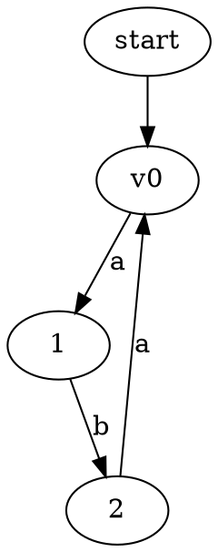

# Использование UCFS для построения примеров

## Общая схема

```
Грамматика (Kotlin DSL)  +  Входной граф (DOT / LinearInput)
              │                          │
              └──────────┬───────────────┘
                         ▼
                   GLL-парсер
                    │        │
                    ▼        ▼
               SPPF (DOT)   RSM (DOT)
                    │        │
                    ▼        │
           split_sppf_dot.py │  (для линейного входа: --full-only)
              │     │    │   │
              ▼     ▼    ▼   ▼
         cluster_N.dot    dot2tikz.py
              │               │
              ▼               ▼
         dot2tikz.py     RSM TikZ (сырой)
              │
              ▼
        TikZ (сырой)
              │
              ▼
      clean_sppf_tikz.py
              │
              ▼
        TikZ (чистый)
```

SPPF от UCFS содержит подграфы (кластеры) для каждого выводимого пути из стартовой вершины. Для линейного входа (книга) нужен только кластер, покрывающий всю цепочку. Для графов — все кластеры.

### split_sppf_dot.py

```bash
# Все кластеры
python3 tools/split_sppf_dot.py input.dot output_prefix

# Только полный кластер (для линейного входа)
python3 tools/split_sppf_dot.py input.dot output_prefix --full-only
```

Полный кластер определяется как кластер с наибольшим диапазоном `[i, j]`.

## Запуск

```bash
# Из директории UCFS/UCFS/
./gradlew :cfpq-paths-app:run
```

Точка входа — `cfpq-paths-app/src/main/kotlin/org/ucfs/paths/Main.kt` (или отдельный файл, см. ниже). Для переключения main-класса изменить `mainClass` в `cfpq-paths-app/build.gradle.kts`.

## Грамматики (Kotlin DSL)

```kotlin
import org.ucfs.grammar.combinator.Grammar
import org.ucfs.grammar.combinator.extension.StringExtension.times   // "a" * "b"
import org.ucfs.grammar.combinator.regexp.Nt
import org.ucfs.grammar.combinator.regexp.Epsilon                    // ε
import org.ucfs.grammar.combinator.regexp.many                        // Kleene star
import org.ucfs.grammar.combinator.regexp.or                          // альтернатива
import org.ucfs.grammar.combinator.regexp.Option                      // опционально
```

### Шаблоны грамматик

```kotlin
// Простая рекурсивная (RHS через /=)
class MyGrammar : Grammar() {
    val S by Nt().asStart()
    init { S /= "a" * S * "b" * S or Epsilon }
}

// С несколькими нетерминалами
class MultiGrammar : Grammar() {
    val A by Nt("a" * "b")
    val S by Nt(A * "c" or Epsilon).asStart()
}

// EBNF: many() = *, Option() = ?, some() = +
class EbnfGrammar : Grammar() {
    val S by Nt().asStart()
    init { S /= many("a" * S * "b") }
}

// Альтернативы с or
class AltGrammar : Grammar() {
    val S by Nt().asStart()
    init { S /= S * S or "a" * S * "b" or Epsilon }
}
```

### Операции

| Операция | Смысл | Пример |
|---|---|---|
| `"a" * "b"` | Конкатенация | `"a"` затем `"b"` |
| `A * B` | Конкатенация нетерминалов | |
| `"a" or "b"` | Альтернатива (строки) | |
| `A or B` | Альтернатива (regexp) | |
| `many(exp)` | Звезда Клини `exp*` | |
| `Option(exp)` | Опционально `exp?` | |
| `some(exp)` | Один или более `exp+` | `exp * many(exp)` |
| `Epsilon` | Пустая строка ε | |
| `/=` | Присвоить RHS в init | `S /= rhs` |
| `asStart()` | Стартовый нетерминал | `val S by Nt().asStart()` |

## Входные данные

### Линейная строка

```kotlin
import org.ucfs.input.LinearInput

val input = LinearInput.buildFromString("a b a b a b")
// Строит граф: 0 --a--> 1 --b--> 2 --a--> 3 --b--> 4 --a--> 5 --b--> 6
```

### Граф (DOT-файл)



- `start -> N` — стартовые вершины. Вершина финальная, если из неё нет рёбер.
- ID вершин — целые числа.
- Метки рёбер — строки.
- Читается через `DotParser().parseDot(dotString)`.

## Запуск парсера и выгрузка результатов

```kotlin
import org.ucfs.parser.Gll
import org.ucfs.sppf.getSppfDot
import org.ucfs.rsm.writeRsmToDot

val grammar = MyGrammar()
val gll = Gll.gll(grammar.rsm, inputGraph)
val sppf = gll.parse()   // Set<RangeSppfNode<Int>>

// SPPF → DOT-строка
val sppfDot = getSppfDot(sppf, "label")

// RSM → файл gen/<path>
writeRsmToDot(grammar.rsm, "output_rsm.dot")
```

### Запись SPPF в файл

```kotlin
import java.nio.file.Files
import java.nio.file.Path

fun saveSppf(path: String, sppf: Set<RangeSppfNode<Int>>, label: String) {
    Files.createDirectories(Path.of("gen", "sppf_examples"))
    Path.of("gen", "sppf_examples").resolve(path).toFile()
        .printWriter().use { it.println(getSppfDot(sppf, label)) }
}
```

### Пример генератора (полный)

См. `UCFS/UCFS/cfpq-paths-app/src/main/kotlin/org/ucfs/paths/SppfExamplesGenerator.kt`.

## Конвертация DOT → TikZ

### dot2tikz.py

```bash
python3 tools/dot2tikz.py input.dot output.tex
```

Строит раскладку по решётке через `dot -Tplain`, генерирует `tikzpicture`. Все узлы получают стиль `[draw]`.

### clean_sppf_tikz.py

```bash
python3 tools/clean_sppf_tikz.py input.tex output.tex
```

Пост-обработка UCFS-сгенерированного SPPF TikZ:
- Классифицирует узлы по типу (Nonterminal, Range, Intermediate, Terminal, Epsilon)
- Заменяет `[draw]` на `symbol_node`, `prod_node`, `intermediate_node`
- Сокращает и переименовывает метки согласно определению SPPF (раздел~\ref{def:SPPF}):
  - Nonterminal: `Nonterminal S, input: [0, 6]` → `$S_{0,6}$`
  - Range: `Range , input: [0, 6], rsm: [S_0, S_4]` → `$R^{q_0,0}_{q_4,6}$`
  - Intermediate: `Intermediate input: 2, rsm: S_3, input: [0, 6]` → `$I_{q_3,2}$`
  - Terminal: `Terminal 'b', input: [1, 2]` → `$b_{1,2}$`
  - Epsilon: `Epsilon RSM: S_0, input: [1, 1]` → `$\varepsilon_{1}$`
- Переименовывает состояния RSM: `S_` → `q_` (для синхронизации с примерами книги)
- Для промежуточных узлов использует первый `input:` (позиция разбиения), а не второй (диапазон узла)

Работает в паре с dot2tikz: сперва `dot2tikz`, затем `clean_sppf_tikz`.

### Стили узлов (определены в `tex/styles/tikz.tex`)

| Стиль | Визуал | Для узлов типа |
|---|---|---|
| `symbol_node` | Прямоугольник со скруглёнными углами | Nonterminal, Terminal, Epsilon |
| `prod_node` | Прямоугольник | Range (диапазонный) |
| `intermediate_node` | Незалитый овал | Intermediate (промежуточный) |

## Типы узлов SPPF (в формате DOT от UCFS)

| DOT shape | Тип | Пример метки |
|---|---|---|
| `invtrapezium` | Nonterminal | `S, input: [0, 6]` |
| `ellipse` | Range | `Range , input: [0, 6], rsm: [S_0, S_4]` |
| `plain` | Intermediate | `Intermediate input: 2, rsm: S_3, input: [0, 6]` |
| `rectangle` | Terminal | `Terminal 'b', input: [1, 2]` |
| `invhouse` | Epsilon | `Epsilon RSM: S_0, input: [1, 1]` |
| `ellipse` | Empty (заглушка) | (пусто) |

Структура: `Nonterminal → Range → (Intermediate | Terminal | Epsilon | Nonterminal)`. Intermediate всегда имеет 2 детей (левое и правое поддеревья).

## Примечания

- RSM-фигуры лучше рисовать вручную в стиле книги (см. `fig_leftrec-rsm.tex`, `fig_example-rsm.tex`). UCFS-вывод RSM использует цветные узлы и subgraph-кластеры, что расходится со стилем.
- SPPF-фигуры — из UCFS DOT через полный конвейер: `split_sppf_dot.py --full-only → dot2tikz.py → clean_sppf_tikz.py`.
- Для графового входа вместо `--full-only` использовать `split_sppf_dot.py` без флага — будут сгенерированы все кластеры (по одному на каждый путь из стартовой вершины).
- Линейный вход через `LinearInput.buildFromString("a b a b")` — пробелы между токенами обязательны.
- Для проверки структуры RSM вручную: UCFS выводит состояния блока S с переходами; $q_0$ — начальное (и допускающее, если есть $\varepsilon$-альтернатива); вызов нетерминала — переход с меткой $q_0$.
